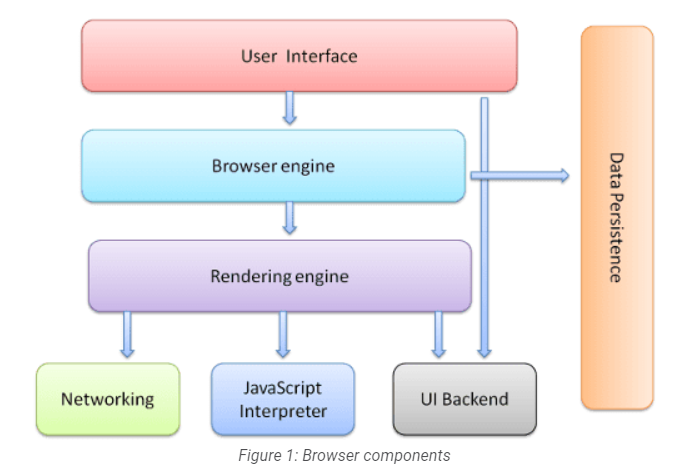
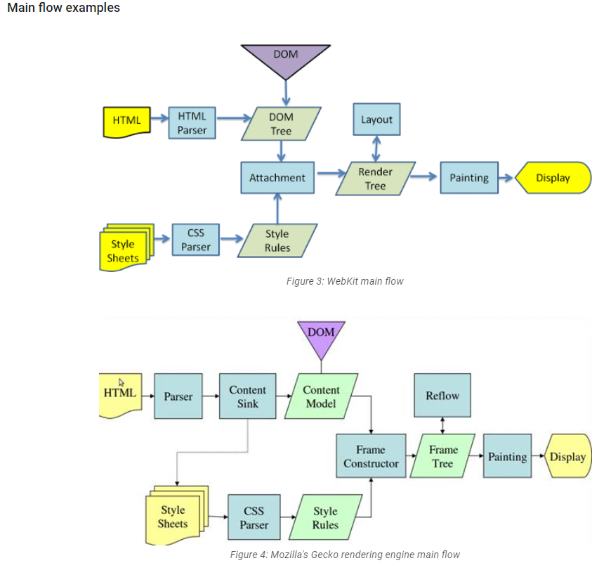
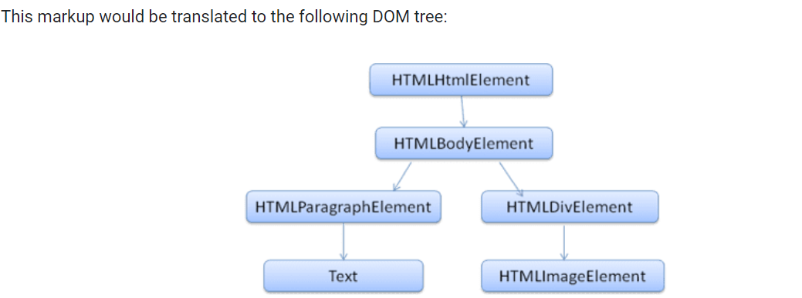
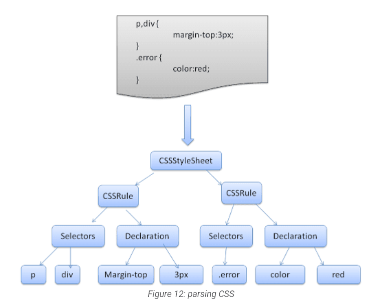
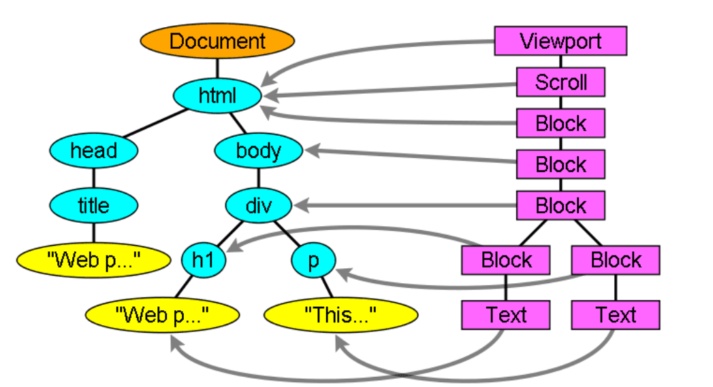

# waht is the main functionality of browser?

browser is mainly used for rendering web sites, browser works on client server model, by using browser we send request to server for particular web page, when server responsed to browser's sent request then we able to see web page on browser

# High Level Components of a browser

- User Interface: The user interface is the space where users interact with the browser. It encompasses elements such as bookmarks, an address bar for entering website URLs, back and forward buttons for navigation, tabs for multitasking, and menus for accessing various browser features and settings. The user interface provides a visually intuitive way for users to control and navigate the browser.

- Browser Engine: The browser engine acts as the core of the browser, handling user interactions, rendering web pages, and facilitating communication with other components. It coordinates the flow of information between the user interface, rendering engine, and other browser components. The browser engine ensures that user actions, such as clicking a link or entering a URL, are properly processed and trigger the appropriate actions within the browser.

- Rendering Engine: The rendering engine is responsible for displaying the content of web pages within the browser. It takes the HTML, CSS, and JavaScript code of a web page and converts it into a visual display that users can see. The rendering engine interprets the HTML structure, applies the CSS styles to determine the page’s layout and appearance, and executes any JavaScript code to add interactivity and dynamic elements to the web page.

- JavaScript Interpreter: The JavaScript interpreter is a component within the browser that executes JavaScript code found on web pages. JavaScript is a programming language commonly used for adding interactivity and dynamic functionality to websites. The interpreter ensures that JavaScript code is properly executed, allowing web pages to respond to user actions, update content dynamically, and interact with APIs and other web technologies.

- Networking: The networking component of a browser handles various aspects of network communication. It is responsible for resolving website URLs (using DNS) into IP addresses, sending HTTP requests to web servers, establishing network connections, and receiving and processing the responses. The networking component plays a crucial role in fetching web page resources, such as HTML, CSS, images, and other files, from servers and delivering them to the rendering engine for display.

- Data storage: This is a persistence layer. The browser may need to save all sorts of data locally, such as cookies. Browsers also support storage mechanisms such as localStorage, session storage.

It is important to note that browsers such as Chrome run multiple instances of the rendering engine: one for each tab. Each tab runs in a separate process.

# Rendering engine and its use

The responsibility of the rendering engine is display of the requested contents on the browser screen. The rendering engine will start getting the contents of the requested document from the networking layer.
The rendering engine will start parsing the HTML document and convert elements to DOM nodes in a tree called the "content tree". The engine will parse the style data, both in external CSS files and in style elements. Styling information together with visual instructions in the HTML will be used to create another tree: the render tree.

The render tree contains rectangles with visual attributes like color and dimensions. The rectangles are in the right order to be displayed on the screen.

After the construction of the render tree it goes through a "layout" process. This means giving each node the exact coordinates where it should appear on the screen. The next stage is painting - the render tree will be traversed and each node will be painted using the UI backend layer.

It's important to understand that this is a gradual process. For better user experience, the rendering engine will try to display contents on the screen as soon as possible. It won't wait until all HTML is parsed before starting to build and layout the render tree. Parts of the content will be parsed and displayed, while the process continues with the rest of the contents that keeps coming from the network.

# Parsers (HTML, CSS)

Parsing a document means translating it to a structure the code can use. The result of parsing is usually a tree of nodes that represent the structure of the document. This is called a parse tree or a syntax tree.

### HTML After Parsing

### CSS After Parsing

# Tree construction

# Script Processors

JavaScript interpreter is a component within the browser that executes JavaScript code found on web pages. JavaScript is a programming language commonly used for adding interactivity and dynamic functionality to websites. The interpreter ensures that JavaScript code is properly executed, allowing web pages to respond to user actions, update content dynamically, and interact with APIs and other web technologies.

# Order of script processing

The model of the web is synchronous. Authors expect scripts to be parsed and executed immediately when the parser reaches a `<script>` tag. The parsing of the document halts until the script has been executed. If the script is external then the resource must first be fetched from the network, this is also done synchronously, and parsing halts until the resource is fetched. This was the model for many years and is also specified in HTML4 and 5 specifications. Authors can add the "defer" attribute to a script, in which case it won't halt document parsing and will execute after the document is parsed. HTML5 adds an option to mark the script as asynchronous so it will be parsed and executed by a different thread.

### script processing in case of DOM and CSS-OM

# Layout and Painting
